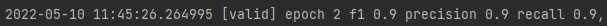

This code is a reproduction of the paper:TXtract: Taxonomy-Aware Knowledge Extraction
for Thousands of Product Categories ACL2020
- arxiv:https://arxiv.org/pdf/2004.13852v2.pdf

这个代码复现了TXtract模型，庞加莱嵌入，带权重的BCE损失，未放上数据集(由于商业原因),可以作为代码参考
实际应用数据集效果：

后期考虑把数据集放出来!

This code reproduces the txtrace model, Poincare embedding, weighted BCE loss, and is n
ot put on the data set (for commercial reasons), which can be used as a code reference.

Effect of practical application dataset:

Consider releasing the data set later!
